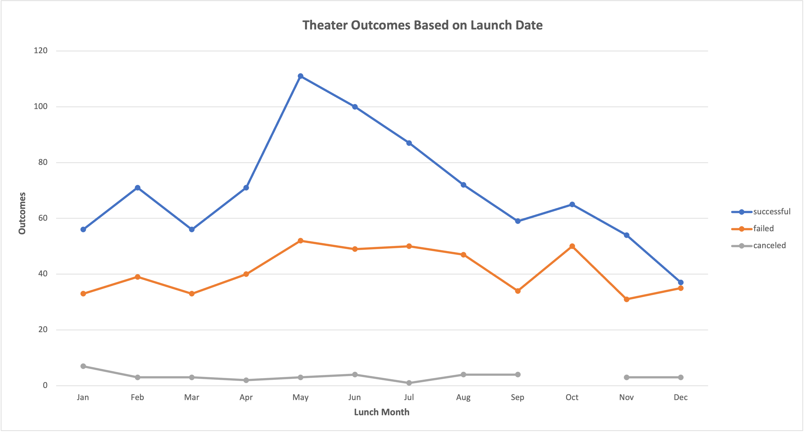

# Kickstarter Analysis
Performing analysis on Kickstarter data to uncover trends.

## 1. Overview of Project

Louise’s is fundraising for her play "Fever". She wants to know the how the campaign outcomes are related to their lunch dates and funding goals. The purpose of this project is to analysis the campaigns fared in relation to their launch dates and their funding goals using the Kickstarter campaigns from 2009 to 2017.

## 2. Analysis of Outcomes Based on Launch Dates

  ### 2.1 Approach

The first part of of this study focused on the "Theatre" category. It investigated the relation between campaigns outcomes and their launch dates. A pivot table was created for the Kickstarter dataset with filters on the "Theatre" category and and lunch years. In the pivot table, the number of successful, failed, or canceled projects were counted by lunch months. Then, a pivot chart was used to show the relationship between the number of successful, failed, or canceled projects and their lunch months. 

  ### 2.2 Results

From the pivot chart, the number of successful projects was related mostly to their lunch months. It was increasing from January to May and decreasing from May to December, with a largest number in May and a lowest number in December. The number of failed projects lunched in the middle of a year was larger than the beginning and the end of a year. There was no strong connection between the number of canceled projects and their lunch months. The number of canceled projects was approximately the same in each month.

## 3. Analysis of Outcomes Based on Goals

  ### 3.1 Approach

In the second part, relationship between outcomes and funding goals was analyzed for the “plays” subcategory. The funding goals were divided into 12 dollar-amount ranges. In each range, the number of successful, failed and canceled projects were counted. Then, the total number of projects in each range and the percentage of successful, failed and canceled projects in each range were calculated. Next, those percentages for each range were demonstrated together in a line chart.

  ### 3.2 Results

The percentages of cancled project were zero for all ranges. The successful percentages are higher in the range "less than 1000" and in the range "between 2000 to 4999", which are 76% and 75% seperately. The percentages of failed projects increased with increasing funding goals. The projects with funding goal between 45000 to 49999 had the highest failed rate, which was 100%.  

## 4. Challenges and Difficulties

The most difficult step in this project was the converting and seperating the original lunch dates in the dataset into months and years. The organization of project categories and subcategories were challenging as well.

## 5. Summary and Limitations

In conclusion, projects lunched in May with a funding goal less than 5000 had the highest successful rate. The percentage of failed projects increased with higher funding goals. The number of canceled projects was not strongly related to lunch month and funding goals in this study. 

In the first part of this study, the largest numbers of successful projects and failed projects were both lunched in May since the total number of projects was largest in May as well. It was difficult to draw a conclution just by the number of each outcomes. Thus, additional calculation such as the percentages of successful, failed and canceled projects are needed. A graph of those percentages and lunch months is recommended.

In this dataset, the number of total projects for "plays" subcategory are not enough. In the second part of analysis, there was only 1 project with goals over 50000 dollars for "plays" subcategory. More projects could be added into the dataset. To better understanding the connection between outcomes and goals, analysis could be performed for other categories/subcategories as well. Charts of outcomes vs. goals for multiple categories are recommended.
